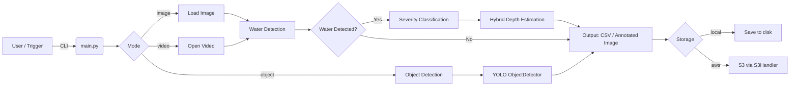

# Project Architecture & Workflow (Simple)

This file explains, in plain terms, how the `flood_project_cleaned` system works and shows a simple flow diagram.

## Overview
- Purpose: detect water in images/videos, classify flood severity, and estimate water depth.
- Entry point: `main.py` (CLI) which calls modules under `modules/`.
- Storage: Local files (default) or AWS S3 (optional via `--storage=aws`).

## Main Components
- `main.py` — CLI and orchestration.
- `modules/water_detection.py` — detects water surface using multiple CV methods.
- `modules/predict_image.py` — loads ResNet18 and predicts flood severity.
- `modules/object_detection.py` — YOLO-based object detection (vehicles/people).
- `modules/hybrid_depth_estimator.py` — combines severity, object anchors, and water coverage to estimate depth.
- `modules/s3_handler.py` — read/write helpers for AWS S3.
- `modules/process_video.py` — processes videos frame-by-frame.

## High-Level Flow



## Step-by-step (simple)
1. Run `python main.py image <path>` or `python main.py video <path>`; default uses local files.
2. `main.py` loads the image/frame.
3. Run water detection (multi-method). If no water, finish and save `No water` result.
4. If water present, run severity prediction using `predict_image` (ResNet18).
5. Estimate depth using `hybrid_depth_estimator`:
   - Severity-to-depth mapping
   - Object-based anchor estimates via YOLO (if objects found)
   - Water coverage heuristic
   - Weighted ensemble → final `depth_cm` and `depth_band`
6. Save outputs (CSV, annotated frames, annotated images) locally or upload to S3 using `S3Handler`.

## Storage modes
- Local (default): files are read/written from the repo working folders.
- AWS S3: add `--storage=aws` and set `S3_BUCKET` env var (or pass bucket to `S3Handler`). The code downloads inputs to temp files, processes them, then uploads results.

## Where to change behavior
- To load models from S3 at start: update `SeverityPredictor` or download model on deployment boot.
- To change output locations: update `main.py` or `S3Handler` calls.

## Deployment notes (short)
- For heavy inference (PyTorch + YOLO), use EC2 with GPU, or SageMaker/ECS with GPU nodes.
- For ETL tasks (manifest generation, large-scale transforms), use Glue.
- For lightweight orchestration, use Lambda to trigger jobs (but not for heavy inference itself).

## Useful Commands
```bash
# Local image test
python main.py image test_images/example.jpg

# S3 image test (requires AWS credentials & S3 bucket)
python main.py image images/example.jpg --storage=aws

# Run smoke tests (CI)
python test_imports.py
python test_s3_integration.py
```

---

If you want, I can also add a single-page PNG of this mermaid diagram or integrate it into `README.md`.